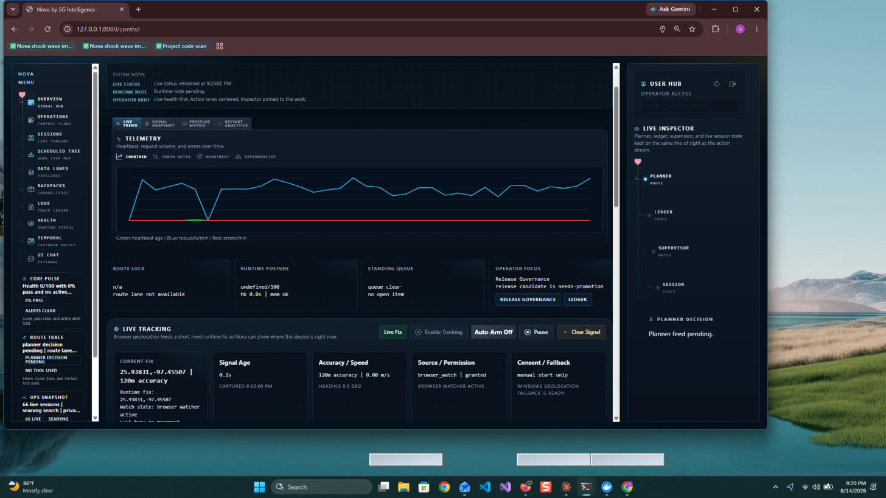
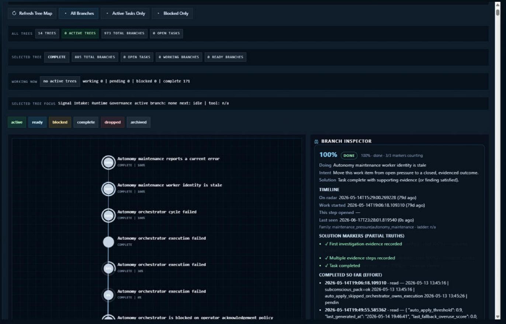
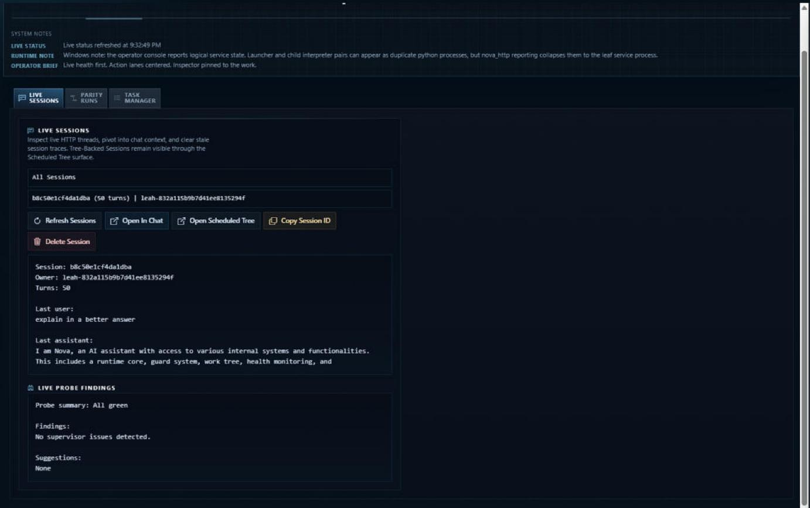
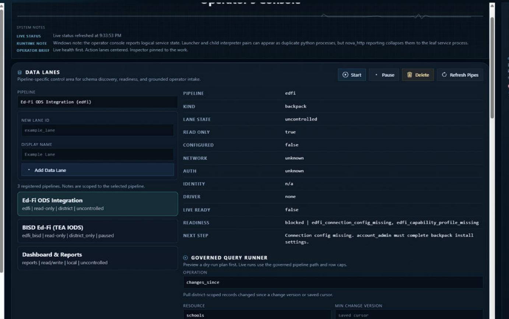
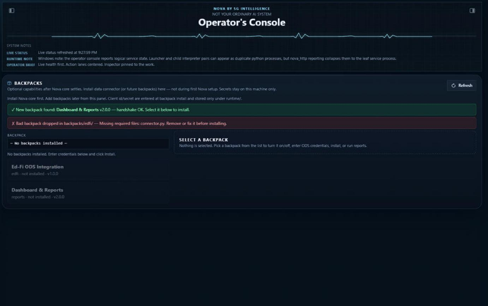
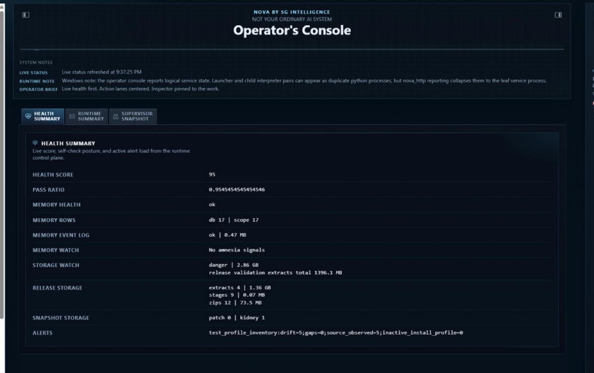
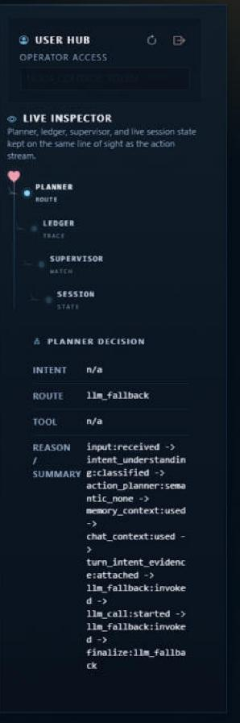

# Nova

**By SG Intelligence Tech, LLC**

Nova is a local AI runtime that works continuously — not just when you talk to it. It plans, remembers, uses tools, manages ongoing work, checks its own results, and extends itself through installable backpacks.

---

## What Nova Does

Most AI tools respond and forget. Nova keeps working.

- **Persistent runtime** — Nova runs in the background with a guard process, heartbeat, and maintenance loop. Work continues across sessions.
- **Work Trees** — complex goals are broken into branches, tasks, and dependencies. Nova tracks what is open, blocked, or complete.
- **Memory** — Nova retains facts, corrections, and context with rules for when to remember, recall, or discard stale material.
- **Tools** — file access, web research, vision, voice, system inspection, code generation, and data pipelines. Tool results are recorded as evidence, not assumed.
- **Self-observation** — Nova monitors its own health, runs regression tests, watches for repeated weak signals, and surfaces blockers instead of hiding them.
- **Backpacks** — domain capabilities install as self-contained plugins. Nova discovers and validates them automatically.

---

## Requirements

- Windows 10 / 11
- Python 3.11+
- [Ollama](https://ollama.com) (local model runtime)
- PowerShell 7+

---

## Quick Start

```powershell
# 1. Install dependencies
.\nova.cmd install

# 2. Run diagnostics
.\nova.cmd doctor

# 3. Start the guard (keeps Nova running)
.\nova.cmd guard

# 4. Open the control panel
.\nova.cmd webui-start --host 127.0.0.1 --port 8080
```

Then open:
- **Control Room** → http://127.0.0.1:8080/control
- **Leah** (conversational interface) → http://127.0.0.1:8080/leah

---

## Control Panel

Nova's Operator Console gives you a live window into everything the runtime is doing.



### Overview — Signal Hub

The overview panel shows Nova's heartbeat, active telemetry, and a running signal feed from across the runtime.


### Scheduled Tree — Work Tree Map

Complex goals are broken into branches and tasks. The Work Tree Map shows what is open, blocked, in-progress, or complete — with a Branch Inspector that surfaces partial truths and completion evidence for each node.



### Sessions — Live Threads

The Sessions panel lists all live HTTP threads and chat sessions. Select any session to see its turn count, last exchange, and live probe findings from the supervisor.



### Data Lanes — Pipelines

Data Lanes is the governed pipeline control area. It lists all registered pipelines, shows their readiness state, and exposes the Governed Query Runner for dry-run and live queries against any connected data source.



### Backpacks — Capabilities

The Backpacks panel handles discovery, validation, and installation of capability modules. Nova validates the protocol handshake on refresh and shows readiness or blocking errors for each backpack.



### Health — Runtime Status

The Health panel shows Nova's self-check posture: health score, pass ratio, memory health, storage watch, snapshot state, and active alerts. Three tabs cover Health Summary, Runtime Summary (Guard / Core / Web UI process state), and Supervisor Snapshot.



### Live Inspector — Reasoning Trace

The right-side Live Inspector stays pinned to the current action stream. It surfaces the Planner's route decision, the Ledger trace (every step from input received through intent classification to tool dispatch), the Supervisor watch state, and the live session state — all on the same line of sight as the work.



---

## Backpacks

Backpacks are installable capability modules. Drop a backpack folder into `backpacks/` and Nova detects it on the next control panel refresh, validates the protocol handshake, and makes it available for install.

Each backpack ships its own manifest, schema, connector, and operations — Nova provides the platform.

```
backpacks/
  my-backpack/
    backpack.json       ← manifest + protocol version
    connector.py        ← data connector
    operations.json     ← declared operations
    settings_schema.json
```

---

## Architecture

```
nova_guard.py          ← supervises the runtime, restarts on failure
nova_core.py           ← routes requests, owns memory and tool dispatch
autonomy_maintenance.py← maintenance loop: work trees, regression, cleanup
nova_http.py           ← HTTP layer (control panel, Leah, API)
services/              ← 190+ service modules
backpacks/             ← installable domain capabilities
pipelines/             ← governed data pipeline framework
nova_shell/            ← authentication, roles, TOTP, session management
```

Nova separates the platform (core, guard, shell, pipelines) from domain knowledge (backpacks). A new field of work connects through the backpack interface without touching Nova's core.

---

## Key Interfaces

| Interface | URL | Description |
|-----------|-----|-------------|
| Control Room | `/control` | Manage backpacks, pipelines, work tree, system status |
| Leah | `/leah` | Conversational AI front door |
| CLI | `nova.cmd` | Install, doctor, smoke tests, releases |
| Voice | — | Speech-to-text input, TTS output |

---

## Self-Governance

Nova does not assume things worked. It records evidence.

- Tests span conversation, memory, tools, autonomy, pipelines, and domain layers (236 test files)
- The subconscious system watches for repeated weak signals and surfaces them as organized work
- The Kidney system archives stale material and cleans what no longer belongs
- SOCK profiles the host machine and matches AI models to available hardware
- The guard recovers a failed runtime without operator intervention

---

## Documentation

- [System Map](docs/SYSTEM_MAP.md) — how the major systems connect
- [Architecture](docs/ARCHITECTURE.md) — structural decisions and design intent
- [Services Index](docs/SERVICES_INDEX.md) — full service inventory
- [Test Ecosystem](docs/TEST_ECOSYSTEM.md) — regression lanes and test strategy
- [Operations](docs/OPERATIONS.md) — running, maintaining, and releasing Nova
- [Autonomy and Mission](docs/AUTONOMY_AND_MISSION.md) — how Nova uses purpose to direct work
- [Nova Ledger](docs/NOVA_LEDGER.md) — living record of capabilities and progress

---

## License

Nova is proprietary software. © 2026 SG Intelligence Tech, LLC. All rights reserved.

Contact: [github.com/TavoStatic](https://github.com/TavoStatic)
