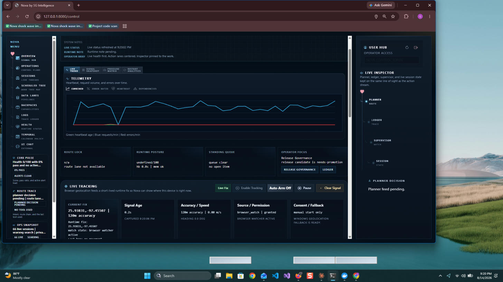
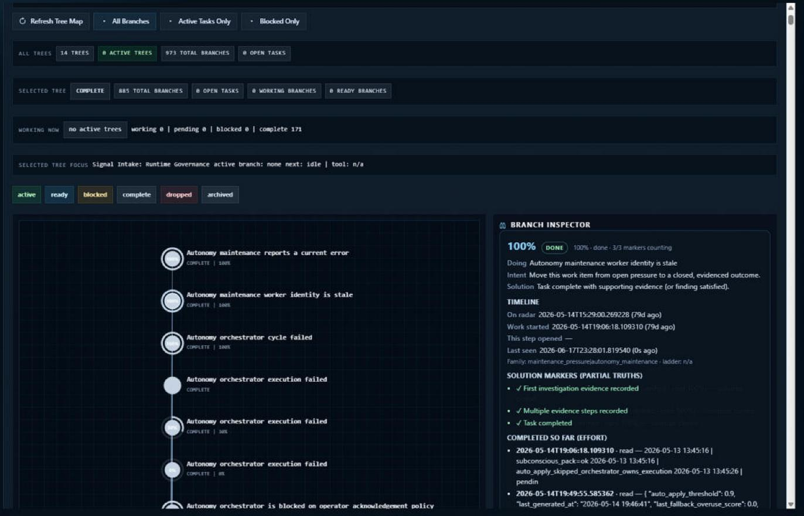
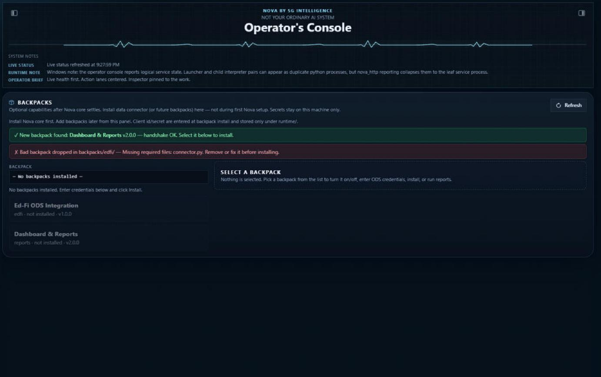
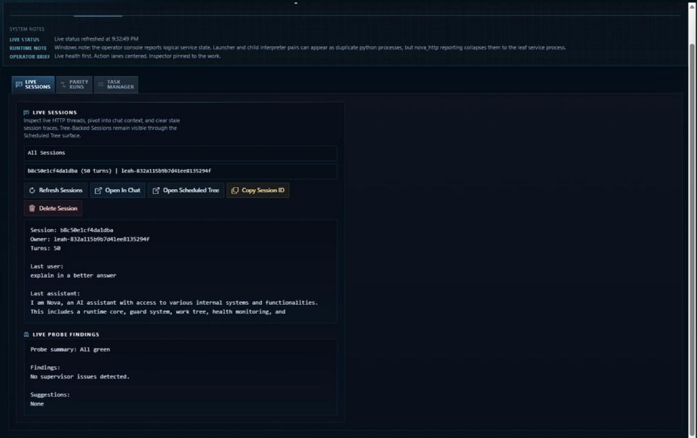
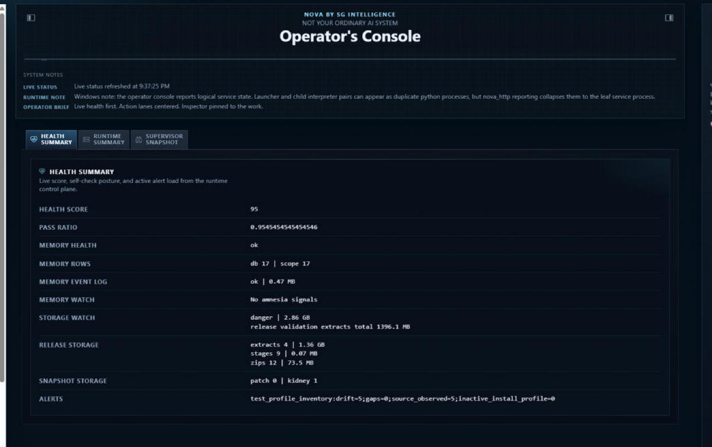

# Nova

**By SG Intelligence Tech, LLC**

<table>
<tr>
<td valign="top" width="58%">

Nova is a Windows-first local AI runtime with supervised core, maintenance, and web processes. It routes conversations and tools through policy, keeps durable work and evidence, and supports optional installable backpacks. This repository is active development; use the source and validation results for current behavior.

</td>
<td valign="top" width="42%">



</td>
</tr>
</table>

---

## What Nova Does

<table>
<tr>
<td valign="top" width="58%">

Nova runs in the background with a guard process, heartbeat, and maintenance loop. Work continues across sessions without a person present. When a goal is too large for one action, Nova organizes it into a Work Tree — a structure that keeps the objective, branches, tasks, dependencies, blockers, tool choices, and evidence together. This gives Nova a way to carry meaningful work forward over time rather than treating every conversation as a fresh start.

Nova retains facts, corrections, and context with rules for when information should be remembered, when it should be recalled, and when stale material should be removed. Memory supports judgment without silently becoming the source of false certainty.

Tool results are recorded as evidence, not assumed. Nova can distinguish between a tool being available, a tool being allowed, and a tool actually returning valid evidence. An attempted action is not the same as a successful result.

</td>
<td valign="top" width="42%">



</td>
</tr>
</table>

---

## Requirements

- Windows 10 / 11
- Python 3.11 or 3.12 with `venv` support
- Windows PowerShell (used by `nova.cmd`)
- [Ollama](https://ollama.com) for model-backed chat and runtime flows (installed separately)
- Git LFS if cloning the source, to materialize bundled Piper assets

---

## Quick Start

```powershell
# 1. Create the virtual environment, install dependencies, and run doctor --fix
.\nova.cmd install

# 2. Run diagnostics
.\nova.cmd doctor

# 3. Start the core under guard supervision
.\nova.cmd guard

# 4. Open the control panel
.\nova.cmd webui-start --host 127.0.0.1 --port 8080
```

Then open:
- **Control Room** → http://127.0.0.1:8080/control
- **Leah** (conversational interface) → http://127.0.0.1:8080/leah

The HTTP process is started separately from the guard. `install` does not install Ollama; model-backed paths require a reachable local Ollama service and models configured for the installation. `doctor` checks the local environment, while a successful install alone does not establish full runtime readiness. See [Operations](docs/OPERATIONS.md) and [Fresh Machine Validation](docs/FRESH_MACHINE_VALIDATION.md).

---

## Backpacks

<table>
<tr>
<td valign="top" width="58%">

Backpacks are optional capability modules discovered from `backpacks/`. The control service lists candidates, checks their manifests and supported protocol versions, and provides separate installation and status operations. A folder's presence alone does not mean its capability is installed or enabled. Backpacks can declare settings, operations, and a pipeline connector; the host applies its own grants and install state.

```
backpacks/
  my-backpack/
    backpack.json       ← manifest + protocol version
    connector.py        ← connector implementation
    operations.json     ← declared operations
    settings_schema.json
```

</td>
<td valign="top" width="42%">



</td>
</tr>
</table>

---

## Architecture

```
nova_guard.py          ← supervises the runtime, restarts on failure
nova_core.py           ← routes requests, owns memory and tool dispatch
autonomy_maintenance.py← maintenance loop: work trees, regression, cleanup
nova_http.py           ← HTTP layer (control panel, Leah, API)
services/              ← runtime and domain services
backpacks/             ← installable domain capabilities
pipelines/             ← governed data pipeline framework
services/nova_shell/  ← authentication, roles, TOTP, sessions
```

Nova separates the platform (core, guard, shell, pipelines) from domain knowledge (backpacks). A new field of work connects through the backpack interface without touching Nova's core.

---

## Key Interfaces

<table>
<tr>
<td valign="top" width="58%">

| Interface | URL | Description |
|-----------|-----|-------------|
| Control Room | `/control` | Manage backpacks, pipelines, work tree, system status |
| Leah | `/leah` | Conversational AI front door |
| CLI | `nova.cmd` | Install, doctor, smoke tests, releases |
| Voice | — | Speech-to-text input, TTS output |

</td>
<td valign="top" width="42%">



</td>
</tr>
</table>

---

## Self-Governance

<table>
<tr>
<td valign="top" width="58%">

Nova records tool and runtime evidence and includes tests across conversation, memory, tools, autonomy, pipelines, and domain layers. Subconscious, Kidney, and SOCK are separate subsystems for signal handling, retention, and host/model assessment. The guard supervises core and schedules maintenance cycles. These mechanisms have individual validation paths; their presence is not a claim that every autonomous or recovery path succeeds end to end.

</td>
<td valign="top" width="42%">



</td>
</tr>
</table>

---

## Documentation

- [System Map](docs/SYSTEM_MAP.md) — how the major systems connect
- [Architecture](docs/ARCHITECTURE.md) — structural decisions and design intent
- [Services Index](docs/SERVICES_INDEX.md) — full service inventory
- [Test Ecosystem](docs/TEST_ECOSYSTEM.md) — regression lanes and test strategy
- [Operations](docs/OPERATIONS.md) — running, maintaining, and releasing Nova
- [Autonomy and Mission](docs/AUTONOMY_AND_MISSION.md) — how Nova uses purpose to direct work
- [Nova Ledger](docs/NOVA_LEDGER.md) — living record of capabilities and progress

---

## License

Nova is proprietary software. © 2026 SG Intelligence Tech, LLC. All rights reserved.

Contact: [sg-intell.tech](https://sg-intell.tech/) · [github.com/TavoStatic](https://github.com/TavoStatic)
